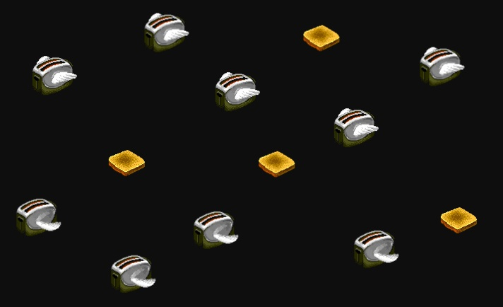

# Flying Toasters Screensaver for macOS

Code uses CSS and WKWebView.

#### Thanks to:

[Bryan Braun](https://www.bryanbraun.com), [@p_g_ pgtwitter ](https://github.com/pgtwitter), [Jonathon Sampson](https://twitter.com/jonathansampson), [Keith Clark](http://codepen.io/keithclark/), [Rob Glazebrook](http://www.cssnewbie.com/pure-css-bouncing-ball), [Ryan Justice](http://ned.highline.edu/~ryan-j/200/final/) and others for posting tutorials & demos on CSS animations.
[N. Landsteiner](http://www.masswerk.at/flyer/), [David Donarumo](http://www.youtube.com/watch?v=M1w1SQ3ezh8), and [Lazy Game Reviews](http://www.youtube.com/watch?v=ANnYbX54oU4) for online preservation of what the original screensavers looked like.
The original screensavers and artwork are © 1989 Berkeley Systems Inc.
